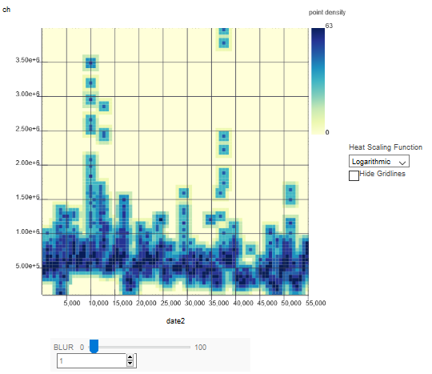
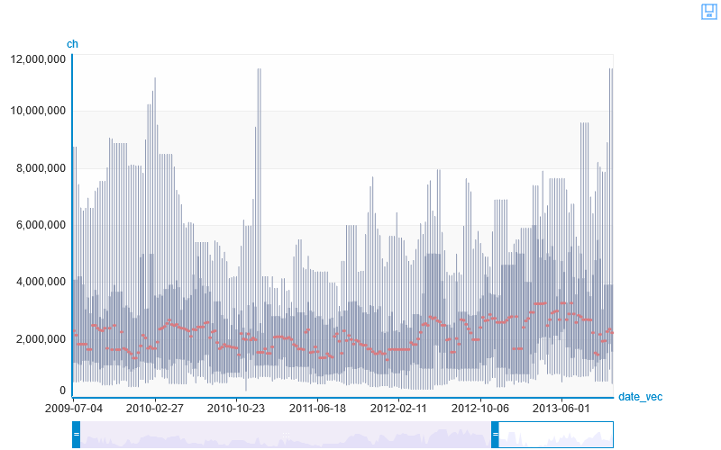
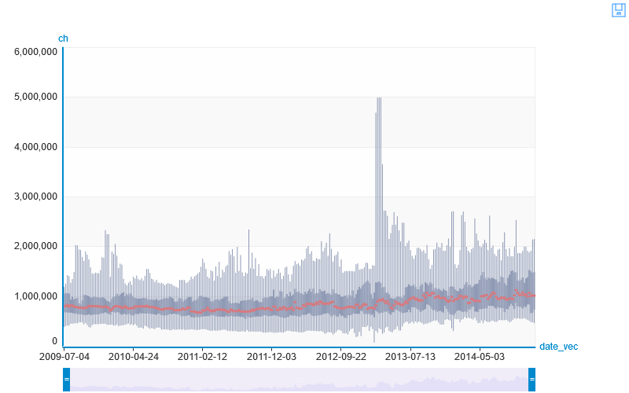
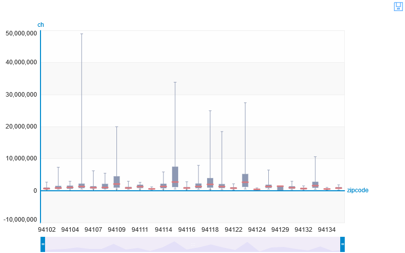

    import graphlab as gl
    sf = gl.SFrame('https://raw.githubusercontent.com/Kolpashnikova/project2/master/pricesscrapedcopy.csv')

    A newer version of GraphLab Create (v2.0.1) is available! Your current version is v1.8.5.
    
    You can use pip to upgrade the graphlab-create package. For more information see https://dato.com/products/create/upgrade.
    2016-07-17 21:56:44,911 [INFO] graphlab.cython.cy_server, 176: GraphLab Create v1.8.5 started. Logging: C:\Users\Kamila\AppData\Local\Temp\graphlab_server_1468760202.log.0
    

<pre>Downloading https://raw.githubusercontent.com/Kolpashnikova/project2/master/pricesscrapedcopy.csv to C:/Users/Kamila/AppData/Local/Temp/graphlab-Kamila/6536/3e1a7a6c-53aa-4582-974a-ff5eff4f453a.csv</pre>

<pre>Finished parsing file https://raw.githubusercontent.com/Kolpashnikova/project2/master/pricesscrapedcopy.csv</pre>

<pre>Parsing completed. Parsed 100 lines in 0.191779 secs.</pre>

    This non-commercial license of GraphLab Create is assigned to kamilakolpashnikova@gmail.com and will expire on October 19, 2016. For commercial licensing options, visit https://turi.com/buy/.
    ------------------------------------------------------

<pre>Finished parsing file https://raw.githubusercontent.com/Kolpashnikova/project2/master/pricesscrapedcopy.csv</pre>

<pre>Parsing completed. Parsed 55147 lines in 0.124592 secs.</pre>

    
    Inferred types from first line of file as 
    column_type_hints=[long,long,str,str,long,long,str,long,long,long]
    If parsing fails due to incorrect types, you can correct
    the inferred type list above and pass it to read_csv in
    the column_type_hints argument
    ------------------------------------------------------
    

    sf['date2'] = sf['date2'].str_to_datetime(str_format='%Y-%m-%d')

    gl.canvas.set_target('ipynb')
    sf[sf['nrooms']==1].show(view="Heat Map", x="date2", y="ch")

     

    sf[sf['nrooms']==5].show(view="BoxWhisker Plot", x="date_vec", y="ch")

     

    sf[sf['nrooms']==2].show(view="BoxWhisker Plot", x="date_vec", y="ch")

        

    sf.show(view="BoxWhisker Plot", x="zipcode", y="ch")

     
